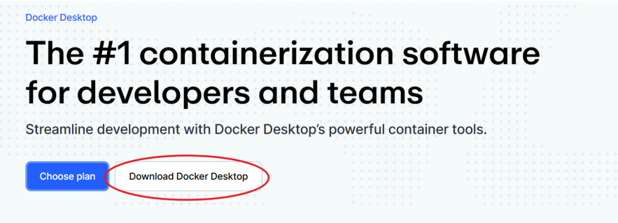

# 票据处理系统 — 使用说明

## 零、获取代码

将收到的压缩包解压到任意目录，进入该目录（即含有 `docker-compose.yml` 的那层）。

> 后续所有终端命令均需在这个目录下运行。

---

## 一、前置准备：安装 Docker 并配置密钥

> Docker 是运行本系统所需的底层环境，安装一次即可。密钥需每次部署时提供。

### 1. 安装 Docker Desktop

前往 [https://www.docker.com/products/docker-desktop/](https://www.docker.com/products/docker-desktop/) 下载对应版本（Windows / Mac / Linux），按提示安装。

安装完成后验证：在终端运行 `docker --version`，出现版本号即表示成功。


### 2. 配置云服务密钥

系统需要连接 Microsoft Azure 的两个服务：
- **Document Intelligence**：用于识别发票/收据
- **OpenAI**：用于语义验证和分类

#### 第一次配置

```bash
# 复制示例配置文件
cp .env.docker.example .env.docker

# 用文本编辑器打开并填入你的 Azure API 密钥
vim .env.docker          # 或用 nano / VS Code 等编辑器
```

#### 配置文件内容

打开 `.env.docker`，按以下格式填入真实的 Azure 密钥：

```env
# Azure Document Intelligence - 发票识别服务
AZURE_DI_ENDPOINT="https://your-resource.cognitiveservices.azure.com/"
AZURE_DI_KEY="your-actual-di-key-here"

# Azure OpenAI - 分类和验证
AZURE_OPENAI_ENDPOINT="https://your-resource.openai.azure.com/"
AZURE_OPENAI_KEY="your-actual-openai-key-here"
```

#### 可选配置

```env
# 办公票据审核时，检查发票接收方是否与预期一致
# 取消注释并填入你的公司名称
OFFICE_EXPECTED_RECEIVER="Ramen Ippin Dortmund"

# 单个文件处理超时时间（秒），默认 180 秒
# BACKEND_FILE_TIMEOUT_SEC=180
```

⚠️ **安全提示**：`.env.docker` 包含敏感信息，切勿分享或提交到版本控制。文件已在 `.gitignore` 中自动忽略。

### 3. 启动系统

在终端进入系统文件夹，运行以下命令：

```bash
# 第一次运行或更新代码后
docker compose up -d --build

# 后续启动（不重新构建）
docker compose up -d
```

等待约 1min，出现如下提示即表示启动成功：

```
✔ Container bills-analysis-app  Started
```

#### 检查系统状态

```bash
# 查看容器状态（应显示 "healthy" 或 "Up"）
docker compose ps

# 查看实时日志（可选）
docker compose logs -f api
```

在浏览器中打开：

**[http://localhost:8002](http://localhost:8002)**

若无法访问，检查：
- Docker Desktop 是否运行（Mac/Windows 菜单栏查看 🐳 图标）
- 防火墙是否阻止了 8002 端口
- 查看日志：`docker compose logs api | tail -50`

### 4. 关闭系统

不使用时，在终端运行：

```bash
docker compose down
```

如需完全清理（删除本地数据缓存）：

```bash
docker compose down -v  # -v 删除绑定的卷
```

---

## 二、功能说明与操作流程

系统分为两个页面：**上传管理** 和 **人工审核**，按顺序操作即可完成一次票据入账。

---

### 场景一：每日结算（BAR + ZBON）

**适用情况**：每天营业结束后，处理当日的小票和汇总单。

#### 第一步：上传管理

1. 打开 http://localhost:8002，顶部默认显示**每日**模式（无需切换）。
2. 选择**日期**（默认今天，点击日历可更改）。
3. 上传文件：
   - 左侧区域：拖入或点击选择 **BAR PDF**（当日各门店小票，可多个）。
   - 右侧区域：拖入或点击选择 **ZBON PDF**（当日汇总单，仅一个）。
4. 文件列表出现在下方"待确认项目"中，确认无误后点击**提交任务**。
5. 状态会变为**处理中**，系统自动识别票据内容，无需等待，可做其他事情。
6. 状态变为**待审核**后，点击**进入人工审核**按钮。


#### 第二步：人工审核

1. 页面会列出系统自动识别出的数据，包括：
   - **BAR 审核项**：门店名称、含税金额、净额、日期
   - **ZBON 审核项**：含税金额、净额、日期
2. 逐行检查数据，如有错误直接在格子里修改。
3. 点击每行右侧的**查看**按钮，可打开对应的原始 PDF 核对。
4. 确认无误后：
   - 点击**选择文件**，上传当月的月度 Excel 汇总表（系统会把本次数据合并进去）。
5. 点击**提交**，等待合并完成（状态变为**已合并**）。
6. 点击**打开结果**，即可查看合并后的 Excel 文件。

---

### 场景二：办公票据（发票 / 对账单）

**适用情况**：处理办公类支出，如房租、水电、采购发票、银行对账单等。

#### 第一步：上传管理

1. 打开 http://localhost:8002，点击顶部切换到**办公**模式。
2. 选择**日期**。
3. 拖入或点击选择所有 **OFFICE PDF**（发票、账单等，可多个）。
4. 点击**提交任务**，等待状态变为**待审核**后，点击**进入人工审核**。

#### 第二步：人工审核

1. 页面列出系统识别的数据，包括：
   - **类型**（如 Miete 房租、Strom&Gas 水电等）
   - **发件人**、**含税金额**、**净额**、**税号**、**公司信息一致**
2. 逐行检查，如类型识别有误，在下拉菜单中手动选择正确类型。
3. 点击**查看**按钮，对照原始 PDF 核对数据。
4. 确认后选择月度 Excel，点击**提交**，等待状态变为**已合并**。
5. （可选）提交成功后，若本次修改了系统识别的类型，页面会出现红色**上报类型错误**按钮——点击后，系统会把你的修正记录下来，帮助后续自动识别更准确。按钮变灰后表示本次已上报完毕。
6. 点击**打开结果**查看最终 Excel。

---

## 三、故障排查

| 情况 | 解决方案 |
|------|--------|
| 浏览器无法访问 | ① 检查 Docker 运行状态：`docker compose ps`<br/>② 查看错误日志：`docker compose logs api`<br/>③ 尝试重启：`docker compose restart` |
| 文件显示"已跳过" | 该文件页数超出限制，需在审核页面手动填写金额 |
| 状态长时间停在"处理中" | 点击页面上的刷新图标 🔄 重新查询状态 |
| 提交后想修改数据 | 直接在审核页面改完再次提交即可，支持重复提交 |
| 合并失败 | 出现红色"重试合并"按钮，点击重试即可 |
| Azure API 认证失败 | 检查 `.env.docker` 中的密钥是否正确<br/>确认 Azure 资源状态是否正常 |
| 系统缓慢 | 减少单批次文件数量，可分多次上传 |

---

## 四、常用命令

```bash
# 查看系统状态和日志
docker compose ps                   # 容器状态
docker compose logs api             # 实时日志（按 Ctrl+C 退出）
docker compose logs api --tail 100  # 最后 100 行

# 重启系统
docker compose restart              # 重启容器
docker compose down && docker compose up -d  # 完全重启

# 清理
docker compose down                 # 停止并删除容器
docker compose down -v              # 同时删除数据卷
docker system prune                 # 清理未使用的镜像/卷（谨慎使用）
```

---

## 五、系统详情

更多技术细节请参考：

- **[DOCKER.md](./DOCKER.md)** — Docker 配置与部署说明
- **[README.md](./README.md)** — 项目总览与架构

---

> **遇到问题？** 
> 
> 请保存以下信息后联系技术支持：
> 1. 截图当前页面状态
> 2. 终端日志：`docker compose logs api > logs.txt`（保存到文件）
> 3. 系统状态：`docker compose ps`
